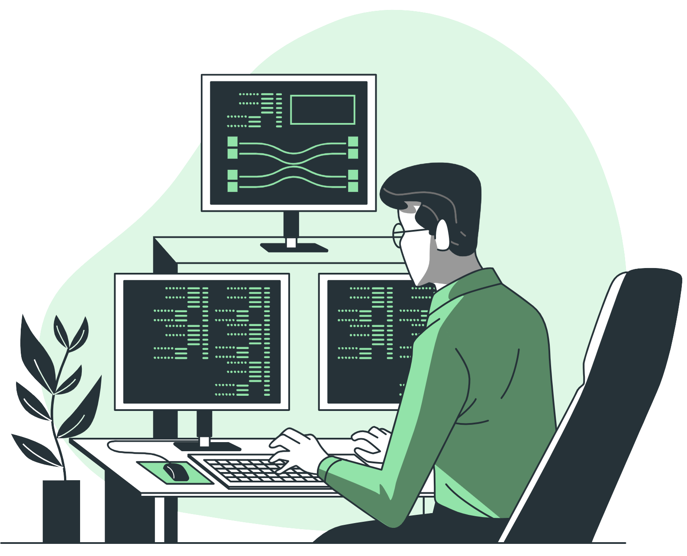

<h1 align="center">Hi, I'm Abbas Alizada! 🚀</h1>

<!--
**AbbasAlizada1380/AbbasAlizada1380** is a ✨ _special_ ✨ repository because its `README.md` (this file) appears on your GitHub profile.

Here are some ideas to get you started:
-->

  

# 🔭 I’m currently working on TET
<!--
 - 🌱 I’m currently learning React -->
- 👯 I’m looking to collaborate on international collaborators
  <!-- 🤔 I’m looking for help with 
- 💬 Ask me about ...
- 📫 How to reach me: abbas.alizadah1380@gmail.com  (+93)777858323   (+93)785468208
- 😄 Pronouns: ...

<h1 align="center">Hi, I'm Abbas Alizada! 🚀</h1>
<h3 align="center">Web Developer | React | Node.js | Tailwind</h3>

<!-- Typing SVG -->

  

<!-- GitHub Stats -->

  

<!-- Streak Stats -->

  

<!-- Trophy Showcase -->

  

<!-- Technologies & Tools -->
### 🛠️ Tech Stack:

<!-- GitHub Contribution Graph -->
### 📈 Contribution Graph:

<!-- Fun GIF -->

  

<!-- Connect with Me -->
### 🤝 Connect with Me:

